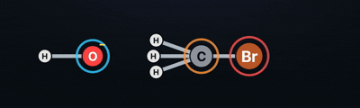

# PromptLab

> Describe a chemical reaction in plain English — watch it come to life as an
> animated mechanism.

<p align="center">
  
</p>

<p align="center"><em>SN2: hydroxide attacks bromomethane from the backside — Walden inversion, bromide departs.</em></p>

## Why PromptLab

Reaction mechanisms are hard to picture from a static textbook arrow. PromptLab
closes that gap: type something like *"what happens when methanol reacts with
acetic acid?"* and it figures out the molecules, balances the equation,
recognizes the reaction, and plays back the mechanism step by step — the
electrons pushing, the bonds breaking and forming, the geometry inverting.

It's built for anyone who learns by seeing:

- **Students** revising for organic or general chemistry exams.
- **Teachers** who want a quick, correct visual to drop into a lesson.
- **The curious** who just want to know what actually happens when you mix two
  things together.

You don't draw structures or memorize SMILES — you describe the reaction the way
you'd say it out loud.

## What it does

Give it a sentence and PromptLab will:

1. **Understand the chemistry** — pull out the compounds you named and look up
   their exact molecular structures.
2. **Balance the equation** — predict the products and work out the
   coefficients, guaranteed atom-by-atom correct (no hand-waving).
3. **Recognize the reaction** — identify the mechanism, and say so honestly when
   it's one we don't cover yet.
4. **Animate it** — play the mechanism as a smooth 2D animation you can scrub,
   pause, and replay.

Reactions it animates today: **SN2 substitution, acid-base neutralization,
esterification, combustion, and precipitation.**

## See it in action

The animations are generated entirely from the real molecules — no per-example
hand-drawing. Swap one reactant for another (bromomethane → 1-chlorobutane,
hydroxide → cyanide) and the animation re-draws itself to match.

```bash
pip install -r requirements.txt

# Build the example animations (works offline, no setup beyond the install)
python -m backend.gen_examples

# Launch the viewer
cd frontend && python -m http.server 8000
#   → open http://localhost:8000/
```

The viewer gives you a reaction picker, play / pause / scrub, and a speed
control. Everything is color-coded so the mechanism reads at a glance:

| Color | Meaning |
|-------|---------|
| 🔵 cyan | nucleophile / base |
| 🟠 orange | electrophile |
| 🔴 red ring | leaving group |
| 🟡 yellow | acidic proton |
| green dashes | bond forming |
| red dashes | bond breaking |

Want to animate your own reaction from a prompt?

```bash
export ANTHROPIC_API_KEY=...   # used to understand and classify the prompt
python -m backend.animation "react bromomethane with hydroxide" \
    --out=frontend/specs/custom.json
```

Then refresh the viewer and pick it from the list. You can also deep-link
straight to a frozen moment with `?spec=<file>&t=<0..1>`, or auto-play with
`?play`.

## Honest about scope

PromptLab shows you the *canonical* mechanism for a recognized reaction type,
animated from the actual molecules. It is a teaching and visualization tool —
**mechanism-templated animation, not a quantum-chemistry or molecular-dynamics
engine.** It won't predict the outcome of a reaction nobody has a template for;
when it doesn't recognize something, it tells you rather than guessing.

## Under the hood

- **Structure lookup** via [PubChem](https://pubchem.ncbi.nlm.nih.gov/), with an
  LLM fallback, every result validated by [RDKit](https://www.rdkit.org/).
- **Exact balancing** by solving the element-balance matrix in rational
  arithmetic — the equation is correct or it errors, never silently wrong.
- **Two-pass classification**: an LLM proposes the reaction type, then a
  rule-based RDKit/SMARTS check verifies the structure actually matches before
  it's accepted.
- **Animations** are generated as keyframe specs from RDKit 2D coordinates and
  rendered as SVG in the browser. The molecule geometry is deterministic — no
  API key needed to build or watch the animations.

```
backend/        understanding, balancing, classification, and animation specs
  templates/    the mechanism choreographers (SN2 + a generic engine)
frontend/       the in-browser animation viewer
  specs/        generated animations
tests/          curated reaction prompts and checks
```

Run the offline animation checks any time:

```bash
python tests/test_phase4.py
```

## What's next

3D ball-and-stick animations of the same mechanisms — rotate, pause, and watch
the geometry change in space — reusing the choreography that already drives the
2D view.
